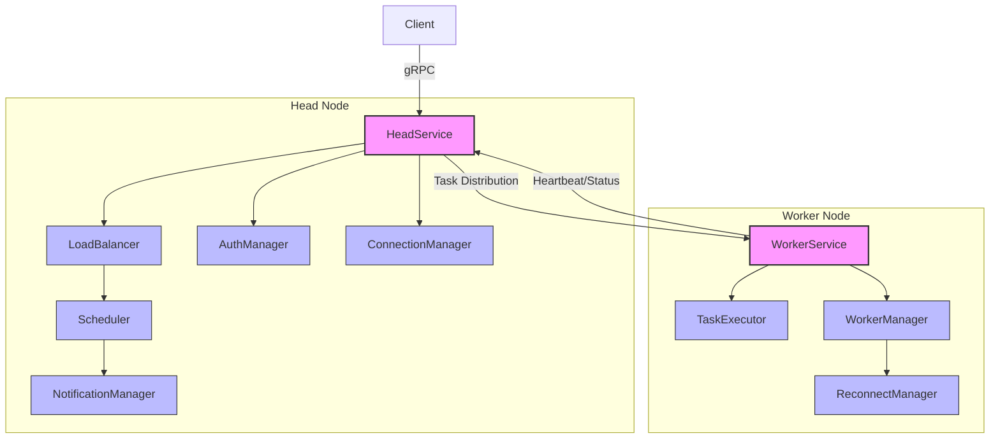

# RustRay

> 一个高性能、可靠的分布式计算框架

[](https://www.rust-lang.org)
[](LICENSE)

## 📖 目录

- [功能特点](#-功能特点)
- [系统架构](#-系统架构)
- [快速开始](#-快速开始)
- [使用指南](#-使用指南)
- [配置说明](#-配置说明)
- [API文档](#-api文档)
- [开发指南](#-开发指南)
- [贡献指南](#-贡献指南)

## ✨ 功能特点

- 🌐 **分布式架构** - 支持多节点协同工作
- ⚡ **高性能通信** - 基于 Rust 和 gRPC 实现
- 🛡️ **安全可靠** - JWT认证和完整错误处理
- 🔄 **动态扩展** - 支持动态添加工作节点
- ⚖️ **负载均衡** - 多种智能调度策略

## 🔧 系统架构



系统采用主从架构，由以下核心组件构成：

### Head Node（主节点）
- **HeadService**: 主节点的 gRPC 服务接口，处理工作节点注册和任务分发
- **LoadBalancer**: 负载均衡器，实现多种负载均衡策略
- **Scheduler**: 任务调度器，管理任务分配和执行
- **AuthManager**: 认证管理器，处理节点间的安全认证
- **ConnectionManager**: 连接管理器，维护与工作节点的连接
- **NotificationManager**: 通知管理器，处理任务完成事件

### Worker Node（工作节点）
- **WorkerService**: 工作节点的 gRPC 服务接口，接收和执行任务
- **TaskExecutor**: 任务执行器，实际执行计算任务
- **WorkerManager**: 工作节点管理器，维护节点状态
- **ReconnectManager**: 重连管理器，处理与主节点的连接恢复

### 通信协议
系统使用 gRPC 进行节点间通信，主要接口包括：
- RegisterWorker: 工作节点注册
- Heartbeat: 心跳检测
- ExecuteTask: 任务执行
- GetStatus: 状态查询

### 数据流
1. 客户端提交任务到 Head Node
2. Head Node 通过负载均衡选择合适的 Worker Node
3. Worker Node 执行任务并返回结果
4. NotificationManager 处理任务完成事件

### 安全机制
- JWT 认证确保节点间通信安全
- 心跳检测保证节点存活性
- 错误处理和自动重连机制

## 🚀 快速开始

### 环境要求

- Rust 1.70.0+
- Protocol Buffers
- CMake

### 安装步骤

1. 克隆仓库：

```bash
git clone https://github.com/yourusername/rustray.git
cd rustray
```

2. 安装依赖：

```bash
./install.sh
```

3. 构建项目：

```bash
cargo build --release
```

### 启动服务

1. 启动头节点：

```bash
./start.sh head
```

2. 启动工作节点：

```bash
./start.sh worker
```

## 📚 使用指南

### 基本概念

| 概念 | 说明 |
|------|------|
| Task | 独立的计算单元，包含函数名和参数 |
| Node | 计算节点，分为头节点和工作节点 |
| Schedule | 任务分配到工作节点的过程 |

### 提交计算任务

1. 创建任务：

```rust
let task = TaskSpec {
    task_id: Uuid::new_v4(),
    function_name: "matrix_multiply".to_string(),
    args: vec!["1000".to_string(), "1000".to_string()],
    kwargs: HashMap::new(),
};
```

2. 提交任务：

```rust
let head_node = HeadNode::new("127.0.0.1".to_string(), 8000);
let task_id = head_node.submit_task(task).await?;
```

3. 获取结果：

```rust
let result = head_node.get_task_result(task_id).await?;
match result {
    Some(task_result) => println!("Task completed: {:?}", task_result),
    None => println!("Task not found"),
}
```

### 自定义计算函数

```rust
#[async_trait]
impl TaskExecutor for MatrixMultiply {
    async fn execute(&self, args: Vec<String>) -> Result<Vec<u8>> {
        let rows: usize = args[0].parse()?;
        let cols: usize = args[1].parse()?;
        let result = self.multiply_matrices(rows, cols);
        Ok(result.into())
    }
}
```

### 任务监控

```rust
let mut rx = notification_manager.subscribe();
tokio::spawn(async move {
    while let Ok(result) = rx.recv().await {
        println!("Task {} completed", result.task_id);
    }
});
```

## ⚙️ 配置说明

配置文件 `config.toml` 示例：

```toml
[node]
address = "127.0.0.1"
head_port = 8000
worker_port = 8001

[security]
jwt_secret = "your-secret-key"
token_expiration = 3600

[scheduler]
strategy = "LeastLoaded"
max_retries = 3
```

## 📖 API文档

### gRPC服务

#### HeadService
- `register_worker` - 注册新的工作节点
- `heartbeat` - 处理工作节点心跳

#### WorkerService
- `execute_task` - 执行计算任务
- `get_status` - 获取节点状态

### 错误处理

| 错误类型 | 说明 |
|----------|------|
| WorkerNotFound | 找不到指定的工作节点 |
| TaskExecutionFailed | 任务执行失败 |
| CommunicationError | 节点间通信错误 |
| AuthenticationError | 认证错误 |
| ResourceNotAvailable | 资源不可用 |

## 💻 开发指南

### 项目结构

```
src/
├── common/       # 公共类型和工具
├── grpc/         # gRPC服务实现
├── head/         # 头节点实现
├── worker/       # 工作节点实现
├── scheduler/    # 任务调度器
├── security/     # 安全相关功能
└── task/         # 任务管理
```

### 性能优化

1. **批量处理**

```rust
let tasks = vec![task1, task2, task3];
let task_ids = head_node.submit_tasks_batch(tasks).await?;
```

2. **资源控制**

```rust
let task = TaskSpec {
    resource_requirements: Some(ResourceRequirements {
        cpu_cores: 4,
        memory_mb: 1024,
    }),
    ..Default::default()
};
```

## 🤝 贡献指南

1. Fork 项目
2. 创建特性分支 (`git checkout -b feature/amazing-feature`)
3. 提交更改 (`git commit -m 'Add amazing feature'`)
4. 推送分支 (`git push origin feature/amazing-feature`)
5. 创建 Pull Request

## 📄 许可证

本项目采用 MIT 许可证 - 详见 [LICENSE](LICENSE) 文件

---

<div align="center">

**[⬆ 返回顶部](#rustray)**

</div>